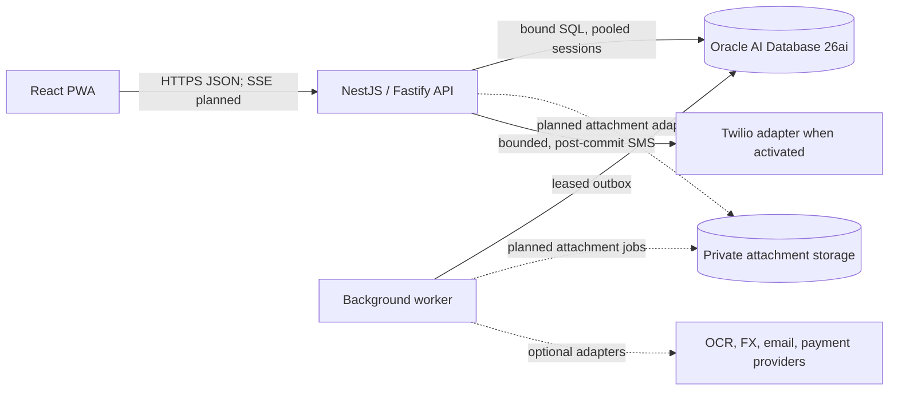
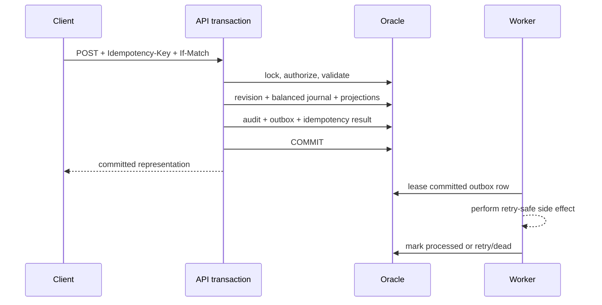

# SPLITO architecture

## System context

SPLITO is an API-first expense-sharing system. The browser never receives an
Oracle credential and never connects to Oracle. Every authorization decision,
allocation validation, and authoritative balance calculation occurs in the API.

The monorepo boundaries are:

- `apps/web`: React PWA, local drafts, explicit offline cache, and API client.
- `apps/api`: versioned REST/SSE interface, authentication, authorization, and
  transactional orchestration.
- `apps/worker`: Oracle-backed outbox consumer foundation. A durable-job
  consumer remains unimplemented.
- `packages/domain`: deterministic, pure allocation, journal, obligation, and
  simplification algorithms shared by preview and server validation.
- `packages/api-client`: checked-in TypeScript types generated from the current
  OpenAPI document plus an `openapi-fetch` wrapper used by the web application.
  Regeneration is explicit and the contract covers the implemented route slice,
  not the full target feature set.
- `packages/ui`: accessible primitives and design tokens.
- `packages/config`: validated runtime configuration.
- `database`: forward-only migrations and synthetic development data.

## Authoritative write path

The API treats one financial mutation as one Oracle transaction. It acquires
context and document locks in stable RAW-ID order, then:

1. Reauthorizes the actor and nested resources.
2. Claims an actor-and-operation-scoped idempotency key and verifies its request
   hash.
3. Checks the resource version (`If-Match`).
4. Validates membership, currency, payer and beneficiary totals using the domain
   package.
5. Inserts an immutable document revision.
6. Appends a balanced `SPLITO_LEDGER_BATCHES` batch and non-zero
   `SPLITO_LEDGER_POSTINGS` rows. Zero-net participants are omitted.
7. Updates rebuildable net and bilateral projections.
8. Inserts an append-only audit event and an outbox event.
9. Stores the idempotent HTTP outcome.
10. Commits explicitly; any failure before commit rolls back DML. Connections
    are closed in `finally` blocks.

Oracle commits DDL implicitly, so schema migrations do not use this promise. See
`operations/migrations.md` for their separate forward-recovery model.

## Mobile identity and session boundary

The React application's only public entry screen is `/login`. It first calls
`POST /api/v1/auth/mobile/request-otp`, then submits the six-digit code to
`POST /api/v1/auth/mobile/verify-otp`. The API normalizes the phone to E.164,
throttles by keyed phone and IP hashes, stores only an OTP-peppered HMAC, and
enforces a five-minute expiry, 60-second resend interval, and five-attempt cap.

Successful verification enters one Oracle transaction. If the number is
unseen, the transaction creates the user, participant, and preferences. It then
locks the identity, revokes any prior unrevoked session, and creates the new
opaque session. A function-based unique index on `SPLITO_SESSIONS` is the
database backstop for one active login per user; the unique E.164 identity makes
that one active login per number.

Development returns `developmentOtp` for OTP testing and captures group-invite
messages in bounded process memory, exposing the corresponding join URL only in
the development response. Non-development OTP and invite messages share one
bounded Twilio REST adapter. Production configuration requires that adapter,
API-key credentials, and exactly one sender-number or Messaging Service SID;
invalid or missing configuration fails startup. The HTTP boundary is covered by
mocked unit tests, but no real carrier delivery is claimed. SMS remains
vulnerable to phishing, SIM-swap, and operator/network attacks, so stronger
recovery and passkey MFA are future production controls.

## Mobile group invitation boundary

Only an active group owner or administrator can add by mobile number. The API
locks and reauthorizes the writable group before looking up a normalized E.164
identity. A verified active user is attached immediately. An unknown number is
not represented as a participant or member: the transaction instead stores one
pending, seven-day invitation for the group/number pair, a digest of a random
opaque token, audit metadata without the number/token, and a minimal outbox
event. Only masked pending destinations are returned to managers.

Carrier delivery runs after that transaction commits. In development it is an
in-memory capture; in non-development it is the shared Twilio adapter with a
bounded timeout. A provider failure is therefore reported honestly while the
pending record remains available for a managed retry. The URL places the bearer
token in the fragment (`/join#invite=...`), the browser removes the fragment
after reading it, and preview/accept hash the token before querying Oracle.

Registration uses the existing OTP flow. Preview and acceptance bind the token
to the authenticated account's verified mobile, the active group, and an
inviter who still has manager authority. Acceptance locks context and invitation
state, creates at most one active membership, and changes `PENDING` to
`ACCEPTED` atomically. A retry by the same account returns the existing
membership; a different account and invalid/expired/revoked material receive the
same generic not-found response.

## Expense collaboration boundary

Active membership grants read access to group expense list/detail responses,
including creator identity. Mutation authority is narrower: only the participant
stored in `SPLITO_EXPENSES.CREATED_BY_PARTICIPANT_ID` can update that expense,
and only while both membership and context remain active and the document is
posted. Group owner/administrator role does not override this ownership check.

An update locks the expense, active creator membership, and context, claims the
actor/operation-scoped idempotency key, then checks `If-Match`. It appends the
next immutable revision, exactly reverses the prior expense journal effect,
posts the balanced replacement in its currency, updates projections, and writes
audit/outbox/idempotency state in one transaction. Cross-group move is rejected.
`createdBy` and server-computed `canEdit` make this boundary explicit to every
client.

## Oracle integration decisions

- Observed locally on 2026-09-12: Oracle AI Database 26ai Free
  `23.26.0.0.0`, `COMPATIBLE=23.6.0`; `FREEPDB1` is open read/write.
- `FREE` is the CDB root. SPLITO uses `localhost:1521/FREEPDB1`.
- The API and worker use the official `oracledb` driver in Thin mode only.
  Thick mode is available solely to a deliberately configured database CLI
  maintenance task, not to runtime services.
- `SPLITO_OWNER` owns objects and runs migrations; `SPLITO_APP` only receives
  required object privileges. The API pool session callback and the worker's
  connection checkout path use the deployment-validated
  `DATABASE_OWNER_SCHEMA` identifier and issue
  `ALTER SESSION SET CURRENT_SCHEMA = SPLITO_OWNER`. There are no public
  synonyms.
- IDs are `RAW(16)`. The API removes hyphens from canonical lowercase UUID text
  before binding a 16-byte buffer, and formats exactly 32 hex digits back as
  `8-4-4-4-12` lowercase text.
- Monetary columns are `NUMBER(19,0)`, never fetched as JavaScript `Number`.
  `oracledb.fetchAsString` and explicit output converters preserve values for
  `BigInt`; JSON uses decimal strings.
- JSON payloads use `CLOB` plus `IS JSON`. Native Oracle JSON is available at the
  observed compatibility level, but CLOB keeps driver and lower-environment
  compatibility predictable. A future migration may benchmark and adopt OSON.
- Audit instants are UTC-labelled `TIMESTAMP(6)` values populated with
  `SYS_EXTRACT_UTC(SYSTIMESTAMP)`. Business dates are midnight `DATE` values and
  always carry a separate IANA timezone.
- Stable pagination orders by a business key, creation timestamp, then RAW ID.
  Page size is bounded. The current cursor is a strictly shape-validated
  base64url encoding of the last sort tuple, but it is not integrity-protected
  and is never an authorization input; authorized SQL predicates still apply.

## Consistency boundaries

Oracle is authoritative. IndexedDB may contain opted-in snapshots, drafts, and
queued mutations, but UI labels them pending and keeps projected local balances
separate. Reconnect processing preserves dependency order, submits client IDs
and idempotency keys, and treats a version conflict as user-visible—not as
permission to overwrite.

Original-currency journals never mix currencies. Display conversion is an
estimate. Posted conversion is an explicit document with balanced outgoing and
incoming batches and a recorded decimal rate.

The worker leases with `SELECT ... FOR UPDATE SKIP LOCKED`, commits the lease,
then performs a bounded side effect. Network delivery is at-least-once; durable
uniqueness and idempotent provider keys make business effects effectively once.
No documentation claims network exactly-once delivery.

## Deployment boundaries

Application containers are stateless except for an explicitly mounted private
development media volume. Oracle contains media ownership/integrity metadata,
while normalized image bytes stay outside the database. Production Oracle
remains external. TLS
terminates at a trusted ingress, and production Oracle uses TCPS/mTLS where the
chosen hosting option supports it. Provider adapters are disabled until their
credentials, webhook verification, legal availability, and sandbox acceptance
tests are configured. SMS is the implemented exception at the code boundary:
production configuration requires the Twilio adapter and credentials, while
operational activation and real carrier acceptance remain deployment gates.
Missing/invalid configuration or a rejected delivery never becomes a successful
API response.

## Current implementation boundary

The repository contains the domain foundation, Oracle schema/migration tooling,
API/worker/web foundations, and deployment/verification scaffolding. The feature
matrix is the source of truth for route/UI completeness. This architecture is a
target and a set of enforced database/domain invariants; it is not evidence that
every feature is implemented or load-tested.
