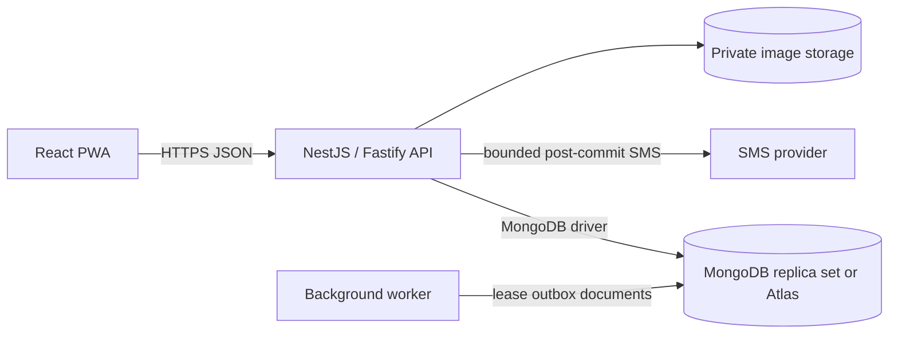
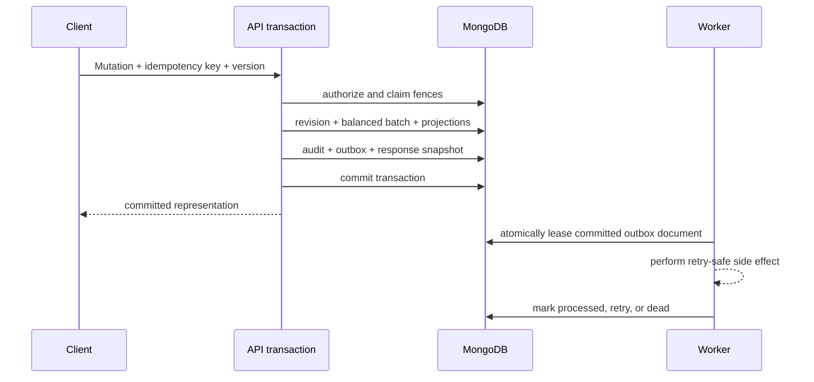

# SPLITO architecture

## System context

SPLITO is an API-first expense-sharing system. The browser connects only to the
HTTPS API; it never receives database credentials or connects to MongoDB. The
API remains authoritative for identity, authorization, allocations, journals,
and balances.

The monorepo boundaries are:

- `apps/web`: React PWA and generated API client consumption.
- `apps/api`: versioned REST API, authentication, authorization, and
  transactional orchestration.
- `apps/worker`: durable outbox leasing and retry processing.
- `packages/domain`: deterministic allocation, journal, obligation, and
  simplification rules.
- `packages/api-client`: checked-in TypeScript types generated from OpenAPI.
- `packages/ui`: accessible primitives and design tokens.
- `packages/config`: validated runtime configuration shared by the API and
  worker.
- `database`: collection validators, index manifests, forward migration,
  connection verification, seed, and reconciliation tools.

## MongoDB transaction boundary

Financial and membership workflows span collections and therefore require a
replica set or sharded cluster with transaction support. MongoDB Atlas meets
that requirement. A standalone `mongod` is intentionally rejected by the
connection verification tool.

A financial mutation runs inside one MongoDB transaction:

1. Reauthorize the actor and advance the context mutation fence.
2. Claim an actor-and-operation-scoped idempotency document and verify its
   request hash.
3. Check the resource version supplied by `If-Match`.
4. Recompute and validate payer, beneficiary, currency, and total invariants in
   the domain package.
5. Insert an immutable expense or settlement revision.
6. Insert a ledger batch containing at least two balanced embedded postings.
7. Update rebuildable net and bilateral projections.
8. Insert an audit event and an outbox event.
9. Store the idempotent HTTP outcome and commit.

Any failure aborts the transaction. The API uses optimistic document filters
and context `mutationVersion` fences instead of relying on client-side state.

## Data representation

- Collection and field names are lower camel case.
- Identifiers are canonical lowercase UUID strings. Deterministic development
  identifiers use the same textual shape.
- Persisted money is BSON `Decimal128` containing integer minor units. The
  domain limit is 19 decimal digits; API JSON serializes amounts as decimal
  strings and never uses binary floating-point for authoritative arithmetic.
- Audit and lifecycle instants are BSON `Date` values in UTC. A business date is
  an ISO `YYYY-MM-DD` string paired with an IANA timezone.
- Revision allocations and ledger postings are embedded because they are
  immutable and always read with their parent. Mutable heads, memberships,
  projections, idempotency records, audit events, and outbox events remain
  separate collections.
- Sensitive token, OTP, IP, and media hashes are BSON binary values. Plain OTPs,
  bearer invitation tokens, and database credentials are never persisted.

`database/schema.mjs` is the deployment-time source for collection validators
and indexes. `apps/api/src/database/mongo.indexes.ts` mirrors the indexes so the
API can ensure them at startup. Migration applies validators with `collMod` to
collections that already exist.

## Mobile identity and session boundary

The public entry route is `/login`. It requests an OTP for an E.164 mobile
number and verifies the six-digit code. The API applies phone- and IP-keyed
throttles, stores an OTP-peppered HMAC, and enforces expiry, resend cooldown, and
attempt limits.

One stable OTP slot exists for each `{mobileE164, purpose}` pair; each issuance
rotates the externally returned `challengeId` and secret material. A first
successful login transaction creates the user, participant, and preferences.

One stable session slot exists for each user: the session document `_id` is the
user ID. Login advances the user's `authFence` and atomically replaces that
slot. Unique indexes protect the external `sessionId` and session-token hash.
Replacing the document invalidates the prior browser session, enforcing one
active login for the phone-bound account.

Development may return `developmentOtp` for local testing. Production fails
closed unless an SMS adapter and its required credentials are configured. SMS
does not protect against SIM-swap or carrier compromise, so stronger recovery
and passkey MFA remain future controls.

## Group invitations and expense ownership

Only an active group owner or administrator can add a member by mobile number.
An active registered user is attached immediately. An unknown number receives a
phone-bound registration link; until acceptance, it has an invitation document
but no participant or membership. Only the invitation-token digest is stored.
Acceptance binds the token to the signed-in user's verified number and adds at
most one active membership in a transaction.

Every active group member can read group expense entries. Mutation authority is
narrower: only the active participant stored as the expense creator may edit
that posted expense. Group administrator status does not override creator
ownership. Editing appends a revision and balanced reversal/replacement batches;
it never rewrites historical allocations or postings.

## Outbox and consistency

MongoDB is authoritative. Browser caches and drafts are non-authoritative and
must show pending/conflict state explicitly. Original-currency journals never
mix currencies; converted displays are estimates unless backed by an explicit
posted conversion workflow.

The worker atomically changes an available outbox document to a leased state,
performs the bounded side effect after that claim, and conditionally records
completion. External delivery is at-least-once. Idempotent handlers and provider
keys are required wherever a duplicate external effect would matter.

## Deployment boundary

The Vercel project hosts the static web build. The API and worker require a
long-running Node.js host with network access to Atlas (or another supported
MongoDB replica set), private media storage, and configured providers. Runtime
credentials are supplied only to those backend environments. Readiness pings
MongoDB internally but returns only `{ "status": "ok" }`.

The feature matrix remains the source of truth for implemented routes and
remaining evidence. Architecture statements describe enforced code and data
boundaries; they are not claims that every planned feature or production load
test is complete.
