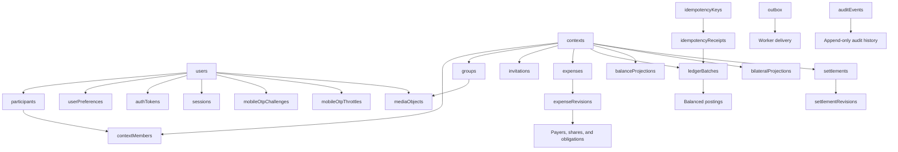

# MongoDB document model

SPLITO currently manages 24 application collections. References use canonical
string identifiers; immutable allocations and postings are embedded in their
owning revision or batch.

## Collection inventory

| Concern                 | Collections                                                       | Role                                                                                         |
| ----------------------- | ----------------------------------------------------------------- | -------------------------------------------------------------------------------------------- |
| Reference               | `currencies`                                                      | Supported currency code and minor-unit metadata                                              |
| Identity                | `users`, `participants`, `userPreferences`, `authTokens`          | Account identity and its stable financial participant                                        |
| Mobile auth             | `sessions`, `mobileOtpChallenges`, `mobileOtpThrottles`           | Single-session slot, OTP slot, and abuse controls                                            |
| Context and groups      | `contexts`, `groups`, `contextMembers`, `invitations`             | Authorization boundary, group presentation, membership, and phone-bound invitations          |
| Expense source          | `expenses`, `expenseRevisions`                                    | Mutable expense head plus immutable revisions with embedded payers, shares, and obligations  |
| Journal and projections | `ledgerBatches`, `balanceProjections`, `bilateralProjections`     | Immutable balanced batches with embedded postings and rebuildable read models                |
| Settlement source       | `settlements`, `settlementRevisions`                              | Mutable settlement head and immutable revision history                                       |
| Durable workflow        | `idempotencyKeys`, `idempotencyReceipts`, `outbox`, `auditEvents` | Expiring replay slots, permanent mutation provenance, background delivery, and audit history |
| Media                   | `mediaObjects`                                                    | Private image ownership and integrity metadata; bytes live outside MongoDB                   |

`schemaMigrations` is a tooling collection and is not part of the 24 application
collections.

## Identity and authentication invariants

- A user owns at most one `USER` participant through the unique optional
  `participants.userId` index.
- `users.mobileE164` is unique when present. First OTP login creates a user,
  participant, and preferences in one transaction.
- A session document uses the user ID as `_id`; login replaces that stable slot.
  `sessionId` and `sessionTokenHash` are independently unique.
- An OTP document is the stable `{mobileE164, purpose}` slot. `challengeId`
  identifies the current issuance externally. OTP and request-IP hashes are BSON
  binary, and expiry uses a TTL index.
- Phone/IP throttle keys are keyed hashes, not plaintext phone numbers or IP
  addresses.

## Context, membership, and invitation invariants

`contexts` is the transaction and authorization boundary for group, direct, and
personal scopes. The current group workflows use `{type: "GROUP", status,
defaultCurrencyCode, simplificationEnabled, mutationVersion}`. Mutations advance
`mutationVersion` to serialize conflicting financial and membership work.

Only one active membership and one active allocation order may exist for a
context/participant combination. Former memberships remain available for
historical attribution.

Unknown invitees do not receive participant or membership documents. A pending
`invitations` document stores normalized E.164 identity and a binary token hash.
A partial unique index allows only one pending invitation for a context/mobile
pair. Acceptance verifies the authenticated user's mobile and activates the
membership transactionally.

## Financial invariants

`expenses` and `settlements` are mutable heads used for status and optimistic
version checks. Their revision collections are append-only. An expense revision
embeds:

- `payers[]`: participant, paid `Decimal128` minor units, allocation order;
- `shares[]`: participant, owed `Decimal128` minor units, allocation order;
- `obligations[]`: debtor, creditor, positive amount, and deterministic match
  order.

Every `ledgerBatches` document embeds at least two postings whose signed
`Decimal128` minor-unit values sum to zero. Expense edits append exact reversal
and replacement batches instead of altering prior postings. Projection
collections are disposable read models and can be checked or rebuilt from all
ledger batches by `npm run db:reconcile`.

Replay data in `idempotencyKeys` expires after its bounded retry window. A
successful mutation also appends an `idempotencyReceipts` document, and the
ledger batch stores that permanent receipt ID. TTL cleanup therefore cannot
erase the journal's mutation provenance.

In `bilateralProjections`, participants are stored in ascending canonical ID
order. A positive `lowOwesHighMinor` means the lower ID owes the higher ID; a
negative value means the reverse. Zero-valued documents may remain so a unique
index key is not removed and reinserted within the same MongoDB transaction.

## Media and operational invariants

`mediaObjects` stores metadata and a binary SHA-256 digest; image bytes remain
in private filesystem or object storage. Each document identifies either a user
avatar or group image and moves through `ACTIVE`, `SUPERSEDED`, or `DELETED`.
The owning user/group stores the current private storage key. Authorization is
checked before media bytes are served.

Outbox documents move through `PENDING`, `LEASED`, `RETRY`, `PROCESSED`, or
`DEAD`. Lease and completion updates are conditional so two workers cannot own
the same valid lease. Audit events use the canonical `actionKey` field and avoid
plaintext secrets or invitation destinations.

Collection validators enforce required document shapes and BSON types. Managed
unique, lookup, and TTL indexes are defined in `database/schema.mjs` and mirrored
by the API runtime manifest.
