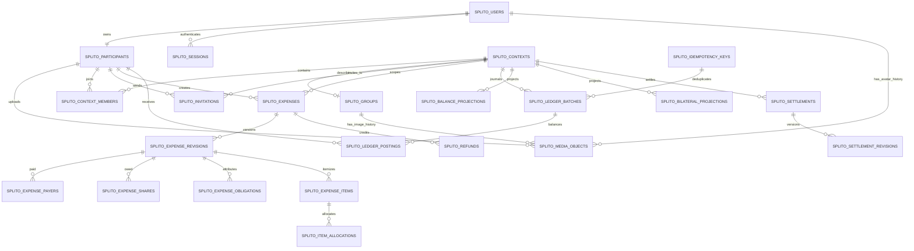

# Entity relationship model

This diagram shows the authoritative financial spine. Operational tables are
listed afterward. Every physical table, including migration infrastructure,
starts with `SPLITO_`; the V001-V006 migration set defines 55 tables (V006
extends `SPLITO_INVITATIONS` and adds no table). V006 is applied on the local
Oracle environment, where schema validation checks all 55 prefixed tables and
23 critical tables.

`SPLITO_CONTEXTS` unifies group, direct, and personal scopes so one journal batch
always has one authorization and currency boundary. `SPLITO_GROUPS` contains
group-specific presentation fields. Historical memberships are new rows; status
changes do not rewrite past expense allocations.

`SPLITO_MEDIA_OBJECTS` stores metadata only; image bytes remain in private
filesystem/object storage. Exactly one of `OWNER_USER_ID` or `OWNER_GROUP_ID` is
set according to `MEDIA_KIND`. Composite foreign keys bind
`SPLITO_USERS.AVATAR_KEY` and `SPLITO_GROUPS.IMAGE_KEY` to media owned by that
same row, while function-based unique indexes permit only one `ACTIVE` avatar or
group image. Replaced rows are soft-deleted after their private object is
reconciled; they are never financial history.

`SPLITO_EXPENSES` is a mutable document head used for optimistic concurrency.
`SPLITO_EXPENSE_REVISIONS`, their payer/share/item children, ledger batches, and
postings are immutable. An edit appends a reversal batch and a replacement
revision/batch. `CREATED_BY_PARTICIPANT_ID` is also the update-authorization
owner: active group members may read, but only that still-active participant can
edit a posted expense. Group role does not override this rule. Projection tables
can be deleted and rebuilt from the journal.

V006 adds `INVITEE_MOBILE_E164` to `SPLITO_INVITATIONS`, validates E.164 shape,
requires a context for group invitations, and uses a function-based unique index
to allow at most one `PENDING` invitation for a group context/mobile pair. Only
the SHA-256 bearer-token digest is stored. Unknown invitees have no participant
or membership row; successful OTP registration supplies the verified user
participant that an atomic acceptance binds into the group. Reissuing a pending
invite rotates its digest and expiry instead of creating a second pending row.

In `SPLITO_BILATERAL_PROJECTIONS`, endpoints are stored in ascending RAW-ID
order. `LOW_OWES_HIGH_MINOR_SIGNED > 0` means the low participant owes the high
participant; a negative value means the high participant owes the low one. Zero
rows are removed.

## Operational table groups

| Concern                 | Tables                                                                                                                                                                                                                              |
| ----------------------- | ----------------------------------------------------------------------------------------------------------------------------------------------------------------------------------------------------------------------------------- |
| Schema control          | `SPLITO_SCHEMA_MIGRATIONS`, `SPLITO_MIGRATION_LOCK`                                                                                                                                                                                 |
| Identity/security       | `SPLITO_USERS`, `SPLITO_USER_PREFERENCES`, `SPLITO_PARTICIPANTS`, `SPLITO_AUTH_TOKENS`, `SPLITO_SESSIONS`, `SPLITO_MOBILE_OTP_CHALLENGES`, `SPLITO_MOBILE_OTP_THROTTLES`, `SPLITO_MFA_METHODS`, `SPLITO_RECOVERY_CODES`             |
| Social/context          | `SPLITO_FRIENDSHIPS`, `SPLITO_INVITATIONS`, `SPLITO_CONTEXTS`, `SPLITO_GROUPS`, `SPLITO_CONTEXT_MEMBERS`, `SPLITO_DEFAULT_SPLITS`                                                                                                   |
| Financial source        | `SPLITO_EXPENSES`, `SPLITO_EXPENSE_REVISIONS`, `SPLITO_EXPENSE_PAYERS`, `SPLITO_EXPENSE_SHARES`, `SPLITO_EXPENSE_ITEMS`, `SPLITO_ITEM_ALLOCATIONS`, `SPLITO_EXPENSE_OBLIGATIONS`, `SPLITO_LEDGER_BATCHES`, `SPLITO_LEDGER_POSTINGS` |
| Financial projections   | `SPLITO_BALANCE_PROJECTIONS`, `SPLITO_BILATERAL_PROJECTIONS`                                                                                                                                                                        |
| Settlement/refund/FX    | `SPLITO_CURRENCIES`, `SPLITO_SETTLEMENTS`, `SPLITO_SETTLEMENT_REVISIONS`, `SPLITO_REFUNDS`, `SPLITO_REFUND_RECIPIENTS`, `SPLITO_REFUND_SHARES`, `SPLITO_PAYMENT_ATTEMPTS`, `SPLITO_FX_RATES`, `SPLITO_CURRENCY_CONVERSIONS`         |
| Durable processing      | `SPLITO_IDEMPOTENCY_KEYS`, `SPLITO_OUTBOX`, `SPLITO_DURABLE_JOBS`, `SPLITO_WEBHOOK_RECEIPTS`, `SPLITO_AUDIT_EVENTS`                                                                                                                 |
| Collaboration/media     | `SPLITO_COMMENTS`, `SPLITO_DISPUTES`, `SPLITO_ATTACHMENTS`, `SPLITO_OCR_RESULTS`, `SPLITO_MEDIA_OBJECTS`                                                                                                                            |
| Scheduled/data movement | `SPLITO_RECURRENCE_TEMPLATES`, `SPLITO_RECURRENCE_OCCURRENCES`, `SPLITO_IMPORT_BATCHES`, `SPLITO_IMPORT_ROWS`, `SPLITO_EXPORT_JOBS`                                                                                                 |
| Client/product          | `SPLITO_NOTIFICATIONS`, `SPLITO_SYNC_MUTATIONS`, `SPLITO_ENTITLEMENTS`                                                                                                                                                              |

Foreign keys preserve shared financial history. Account deletion anonymizes a
user identity instead of cascading through participant, revision, or journal
records.

Mobile OTP challenges deliberately precede identity creation and therefore bind
to a normalized E.164 number rather than a user foreign key. Only the
OTP-peppered HMAC and terminal/attempt metadata are stored. A successful
verification creates an unseen identity atomically, while unique E.164 and
one-unrevoked-session indexes enforce one account and one active login per
number. `SPLITO_MOBILE_OTP_THROTTLES` holds keyed phone/IP abuse counters, not
plaintext phone or IP lookup values.

Mobile group invitations similarly precede membership but not necessarily
identity creation: they bind to normalized E.164 plus a token digest. Acceptance
requires the same verified E.164 on the authenticated active user, then stores
`INVITEE_PARTICIPANT_ID` and the terminal response timestamp. Expired, revoked,
and accepted rows are retained as lifecycle/audit state; they are not active
members.
